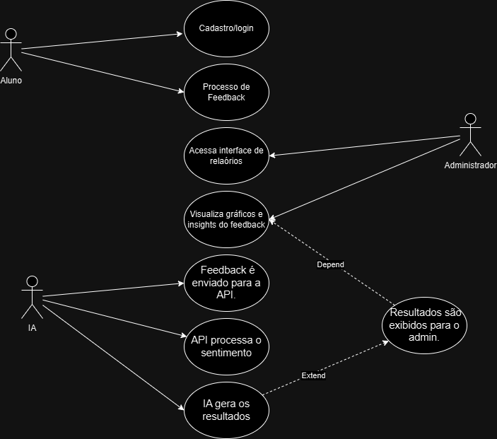

# Diagrama de Caso de Uso - Feedback de Curso

Casos de Uso (Detalhamento)

1.Cadastro/Login (Aluno)

Descrição: Permitir que alunos se cadastrem e façam login para acessar a plataforma.

Atores Envolvidos:Aluno.

Fluxo Principal:  
O aluno acessa a página de login/cadastro.
Insere suas credenciais (e-mail, senha).
O sistema verifica a autenticidade das informações.  
Acesso autorizado.

Fluxo Alternativo: Em caso de erro, o sistema retorna mensagens específicas (e.g., "Senha incorreta").

2.Enviar Feedback (Aluno)
Descrição: Registrar a opinião sobre um curso.

Atores Envolvidos: Aluno, API de IA.

Fluxo Principal:
O aluno acessa a página do curso.
Preenche o formulário de feedback.
O feedback é enviado para o backend, armazenado no banco de dados e enviado à API de análise de sentimentos.

Fluxo Alternativo: Caso a conexão com a API falhe, o sistema armazena o feedback para envio posterior.

3.Visualizar Relatório de Sentimentos (Administrador)
Descrição: Permitir que administradores acessem relatórios de feedback com análise de sentimentos.

Atores Envolvidos: Administrador.

Fluxo Principal:
O administrador faz login no sistema.
Acessa o painel de relatórios.
Visualiza gráficos e análises geradas pela API de sentimentos.

4.Análise de Sentimentos (API de IA)
Descrição: Realizar análise automática dos textos de feedback para gerar insights.

Atores Envolvidos: API de IA, Feedbacks (dados).

Fluxo Principal:
O feedback enviado pelo aluno é processado pela API.
A API retorna informações de polaridade (positivo, negativo, neutro) e palavras-chave associadas.

|Etapa|Ator|Descrição|Fluxo Principal|
|---|---|---|---|
|Cadastro|Aluno|Permite que o aluno crie uma conta e faça login na plataforma|1.Aluno acessa a tela de login 2.Insere dados de acesso. 3.Validação e login são confirmados.|
|Enviar Feedback|Aluno|O aluno envia uma avaliação para o curso específico|1.Aluno seleciona o curso. 2.Insere feedback. 3.Envia o feedback que é registrado no sistema.|
|Visualizar Relatório de Sentimentos|Administrador|O administrador acessa o relatório de feedbacks com análise de sentimentos.|1.Administrador acessa a interface de relatórios. 2.Visualiza gráficos e insights dos feedbacks.|
|Análise de Sentimento|API de IA|Realiza a análise de sentimento do feedback recebido.|1.Feedback é enviado para a API. 2.API processa o sentimento. 3.Resultados são exibidos para o admin.|

Imagem Do Diagrama de Caso de Uso:

## Exemplo de Cenários de Casos de Uso

1.Enviar Feedback (Aluno)  
Cenário:
Aluno enviando feedback após concluir um curso

Contexto:
Ana finalizou um curso de "Introdução à Ciência de Dados" e deseja avaliar sua experiência.

Ação:
Ana faz login no sistema e acessa a página do curso finalizado.
Ela clica no botão "Enviar Feedback".
Preenche o formulário com comentários positivos sobre a didática do curso e sugestões de melhorias.
O sistema armazena o feedback no banco de dados e envia automaticamente o conteúdo para a API de análise de sentimentos.

Exceção:
Caso a conexão com a API falhe, o sistema exibe a mensagem: "Estamos enfrentando problemas técnicos. Seu feedback foi armazenado e será enviado posteriormente."

2.Visualizar Relatório de Sentimentos (Administrador)

Cenário:
Administrador monitorando feedbacks para avaliar a qualidade dos cursos.

Contexto:
Carlos, administrador da plataforma, quer avaliar a satisfação dos alunos com o curso "Python para Iniciantes".

Ação:
Carlos faz login com suas credenciais de administrador.
Ele acessa o painel de relatórios da plataforma.
Seleciona o relatório de "Python para Iniciantes". Visualiza gráficos interativos que mostram a polaridade dos feedbacks (75% positivos, 25% negativos) e as principais palavras-chave mencionadas.
Com base nos insights, ele identifica que os alunos destacam a clareza das aulas, mas mencionam dificuldades com exercícios práticos.

3.Análise de Sentimentos (API de IA)

Cenário:
API processando feedback e retornando resultados

Contexto:
O sistema recebeu o feedback de Ana, com o seguinte comentário: "O curso foi ótimo! A didática do professor é excelente, os exercícios são desafiadores."

Ação:
O sistema envia o texto para a API de análise de sentimentos.
A API processa o texto e identifica uma polaridade positiva.
Também extrai as seguintes palavras-chave: "didática excelente", "exercícios desafiadores".
O sistema armazena os resultados e os disponibiliza no painel de relatórios para o administrador.

Exceção:
Se a API não conseguir processar o texto devido a problemas de formatação, o sistema registra o erro e exibe a mensagem: "Falha na análise de sentimentos. Tente novamente mais tarde."

