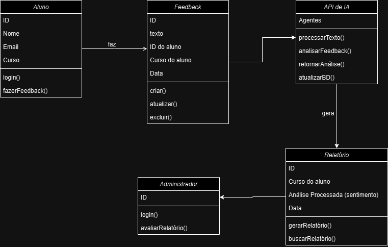

# Diagrama de Classes - Feedback de Curso

Classes principais:

Aluno
- Atributos: id, nome, e-mail, curso.
- Métodos: fazerFeedback(), login().

Administrador
- Atributos: id.
- Métodos:avaliarRelatório(), login().

Feedback
- Atributos: id, texto, curso do aluno, id do aluno, data.
- Métodos: criar(), atualizar(), excluir().

Relatório
- Atributos: id, curso, análise processada (sentimento), data.
- Métodos: gerarRelatório(), buscarRelatório().

API de IA
- Atributos: Agentes.
- Métodos: processarTexto(), analisarFeedback(), retornarAnálise(),atualizarBD().

Imagem Do Diagrama de Classes:

