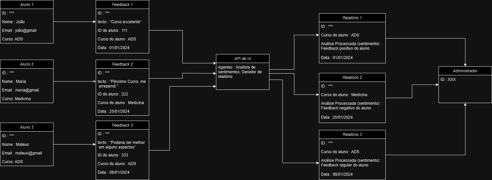

# Diagrama de Objeto - Feedback de Curso

Diagrama de Objetos (Exemplo)

Instância de Usuário:
aluno1: Usuario (id=101, nome="João", tipo="aluno")

Instância de Feedback:
feedback1: Feedback (id=2001, texto="Curso excelente!", alunoId=101, sentimento="positivo")

Imagem Do Diagrama de Objetos:

