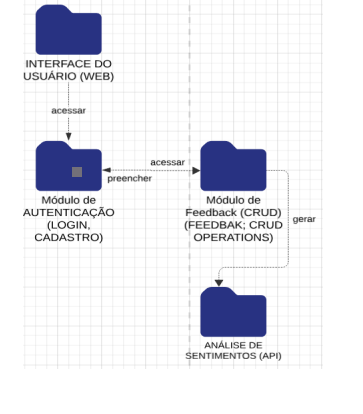

# Diagrama de Pacote - Feedback de Curso

Pacote 1: Interface do Usuário
Contém os componentes do frontend, incluindo páginas de login, envio de feedback e visualização de relatórios.

Pacote 2: Backend (Controle e Processamento)
Inclui a lógica de autenticação, gerenciamento de feedback e comunicação com a API de IA.

Pacote 3: Banco de Dados
Tabelas relacionadas a usuários, feedbacks, e relatórios de sentimento.

Pacote 4: Integração com API
Pacote dedicado à integração com serviços de análise de sentimentos.

Imagem Do Diagrama de Pacote:

